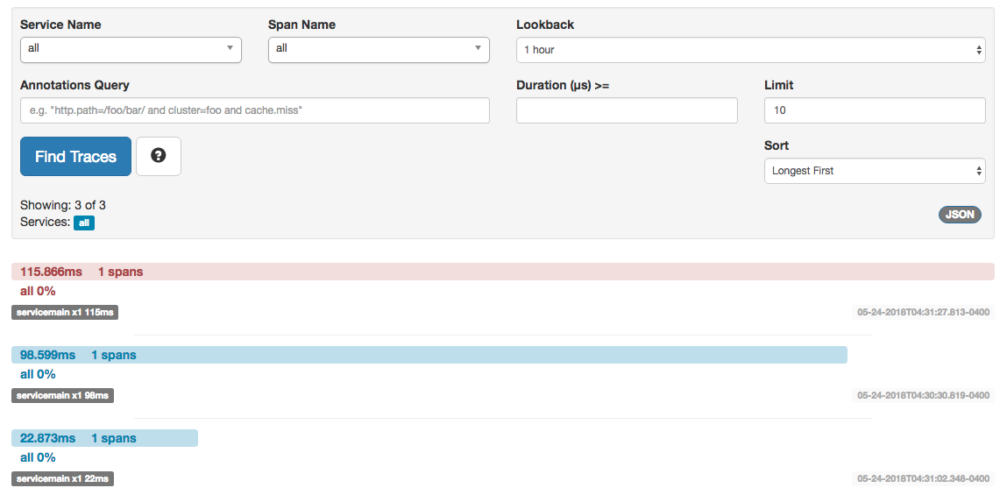

## Description

This sample is meant to demonstrate having a proxy to an external service,
in this case the hosted `httpbin` application.

## Usage

Assuming you are in the `./envoy-samples/external-proxy-tracing` path, run the following:

```bash
# start the services
docker-compose up -d

# ssh into the container
docker exec -it tracing-proxy /bin/bash

# execute some commands to be traced
curl http://localhost:9000/
curl http://localhost:9000/status/400
curl http://localhost:9000/status/500
```

If you open up a browser now and navigate to `http://localhost:9411/zipkin/` and find all
traces, you should now see some traces with different decorators (matching by paths) and
one trace with an error.


