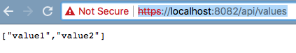

## Description

This sample is meant to demonstrate having TLS termination at a container node 
as opposed to having application code performing that work.

This should be ideal considering every HTTP framework likely has their own way 
of using HTTPS.

## Usage

**TODO:** Discuss how to generate development certificates locally

Assuming you are in the `./envoy-samples/ssl` path, run the following:

```bash
# start the services
docker-compose up -d
```

If you open up a browser now and navigate to `https://localhost:8082/api/values`, you should
see a basic .NET Core application using HTTPS with no work configuring it in the application.


